**FoodTrucksATX Application**

GitHub URL: https://destinatx.github.io/Project-1/
GitHub: https://github.com/DestinATX/Project-1/settings

**FoodTrucksATX**

Designed for users of all ages to determine the available food trucks in the user&#39;s desired area of Austin, TX then allowing them to choose to walk, bike, take public transit, or drive based on their desired time to arrival.

**User Stories**
22 year old college student used this application on his laptop to find a food truck nearby. His first remark was, &quot;Oh wow, this looks more like a third project instead of a first project.&quot; He ended up driving to Yummy Thai on Rainey Street.
**User Input Video**   

**Acceptance Criteria**
- Given I am within the City of Austin in search of a food truck, this application allows me to find options around town that I wish to target.
- If I desire a particular type of food or cuisine, the FoodTrucksATX application allows me to search by food type with all results provided. If I desire to see all food trucks, regardless of food type, that should also be an option.
- Given options to walk, bicycle, take public transit, or drive, I am able access directions that let me know how long my trip to the desired food truck will take and directions to find my way there.
- Having an up to date weather report available allows me to make the best travel decision.
- Then I expect the address, directions, map, duration of the trip, and few facts about the food truck I select.
- After determining this application is helpful, having Linked-In information on the development team allows me to contact the group to find out what other applications may be available.

**Bugs and Rabbit Holes**
- Began defining &quot;destinATX, a transportation application but after several days were not able to gain access to Uber and Lyft APIs so redirected efforts to focus on FoodTrucksATX.
- Used geo-location API from the Google API library, because of the CORS error which forced using anywhere cors API; however, this did not yield the correct location but resolved the CORS error. To accomplish the intended goal, instead used the browser&#39;s HTML5 Geolocation feature along with the Maps JavaScript API.
- While Materialize offered some incredible tools for the project, it is challenging to work with when manipulating text and image alignment within themes and containers
- Team had planned to have users search on how they wanted to travel, how long or distance to their destination, and what type of food. Time or duration required data storage and the team agreed this should be added to the nice to have. Alternatively, the &quot;time available&quot; section of the Search Screen became more of a flashy carousel of food choice ideas.

**Examples of Code**

|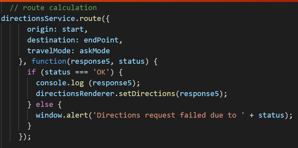 
**Route Calculator**

|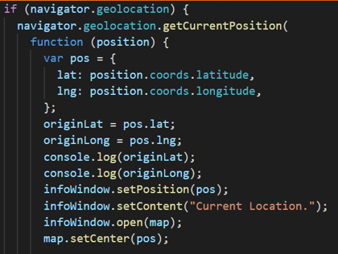
**Geolocation** 

|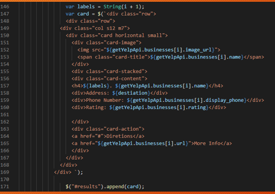 
**Template Literal**
- The template literal was crucial to transferring food truck data to our cards. We transferred all data to our results div on the index.html page. The template literal allowed us to comfortably implement a for loop for all rendered food trucks dynamically displayed upon pressing search. Our data used on each card came from the Yelp Fusion API consisting of Name, Address, URL link, and Rating for each food truck. There is also a Direction button that combines with the Google Directions API to display steps to find routes for the user.

|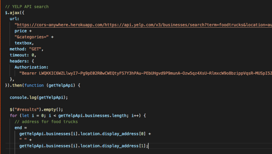
**Yelp API** 

**Resources and Tech Stack**
Frontend:  _HTML, CSS, JavaScript, JQuery, AJAX, JSON_
Tools_: Postman_
APIs: _Google Maps JavaScript, Google Directions, CORS Anywhere Yelp, OpenWeather, CityBikes_
_GitHub_ used to leverage project management, workflow, and application/file storage.

**Team Management**

|  **Adrian Palacios**  _Full-Stack Engineer_

linkedin.com/in/adrian-palacios-centraltexas/
adrianpalacios33@yahoo.com %20252-7270)(956) 252-7270

|  **Changyeon (Daniel) Hong** _Full-Stack Engineer_

linkedin.com/in/changyeon-hong-centraltexas/
hongchangyeon@gmail.com%20218-3825)(737)218-3825

|  **Diane Candler** _Full-Stack Engineer_

linkedin.com/in/diane-candler-centraltexas/
[dianedcandler@gmail.com](mailto:dianedcandler@gmail.com)%20964-9473) (512)964-9473

|  **Marlon Mora** _Full-Stack Engineer_

linkedin.com/in/dmarlon-mora-centraltexas/
[marlonmora.ndr@gmail.com](mailto:marlonmora.ndr@gmail.com)-218-3825)(929)2296136

Review the team&#39;s work on our GitHub [https://github.com/DestinATX/Project-1](https://github.com/DestinATX/Project-1)
Or URL [https://destinatx.github.io/Project-1/](https://destinatx.github.io/Project-1/)

**Phase Review**
|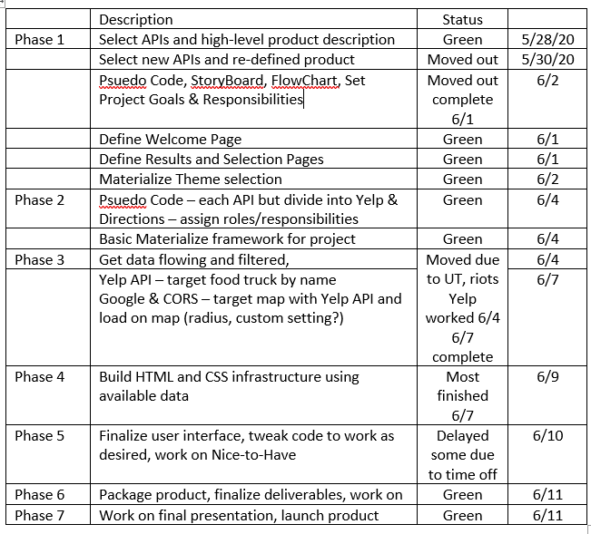

**Materialize inspiration**
|

**Storyboard**
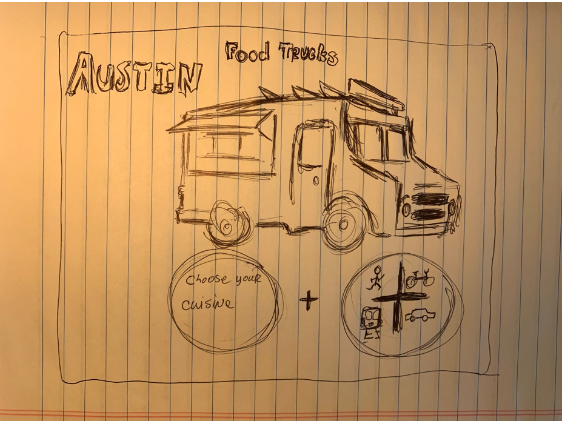
Welcome Page
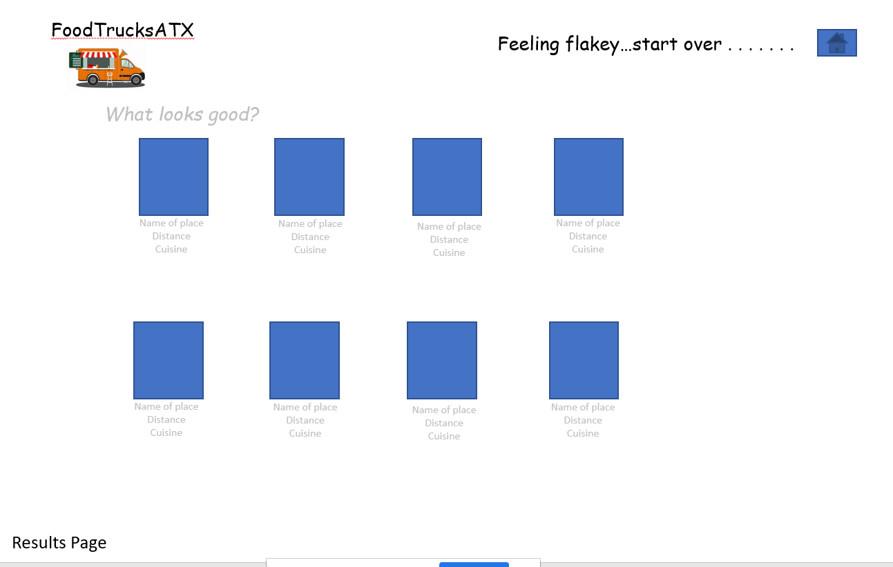

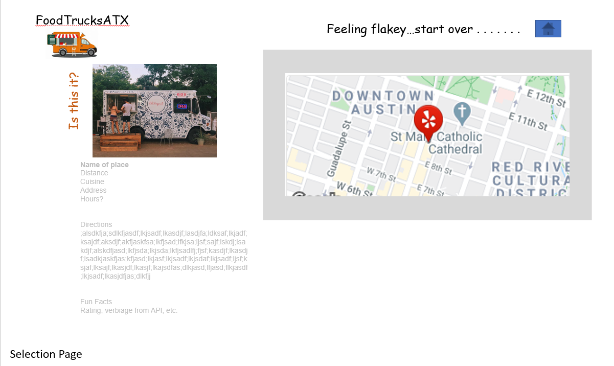

**Initial Flow Chart**

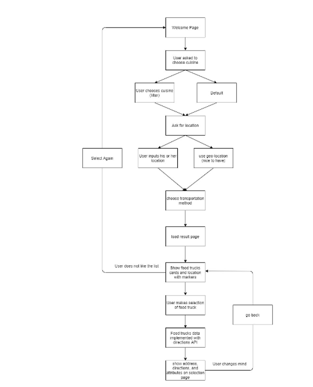

**Modified Flow Chart**

**UI Design**

**Welcome Page**

|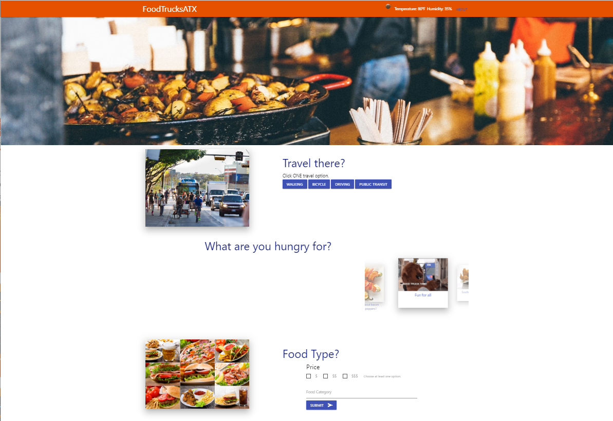

**Results Page**

|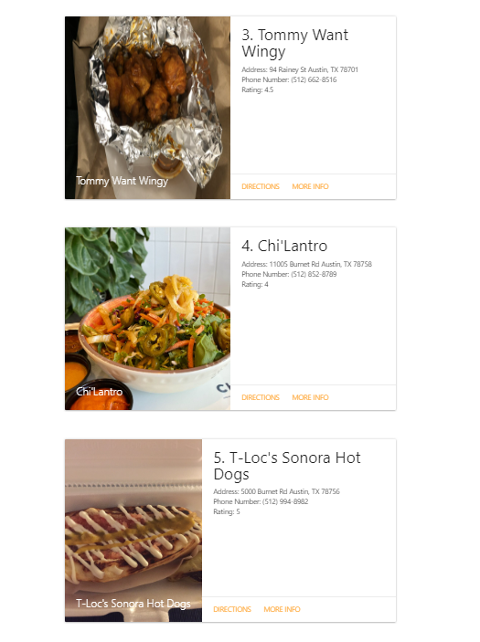

**Selection Page**

|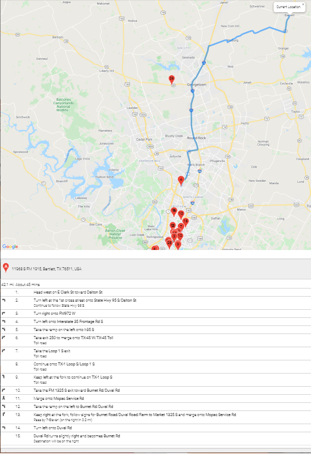

**Developers, About, Footer w/Linked-In hyperlinks**

|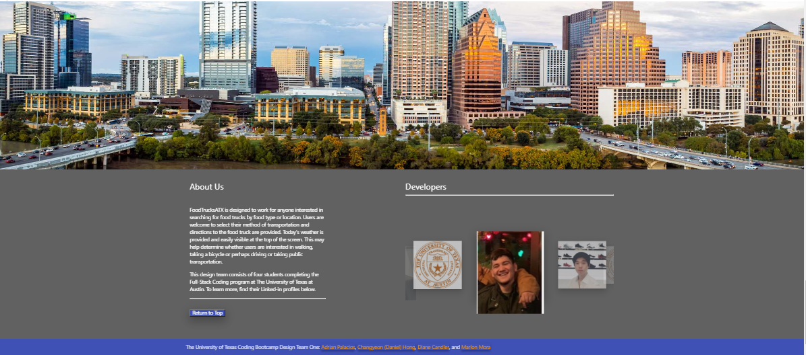

**Google Maps API**
_The Maps JavaScript API lets you customize maps with your own content and imagery for display on web pages and mobile devices._

**Google Directions API**
_With the Directions API, it is possible to access driving, cycling, walking and public transportation routing by using an HTTP request._

**Yelps API**
_Used to source all of the Austin food trucks and attributes such as name, price range, rating, location, foot type, etc._

**cors-anywhere**
_This API enables cross-origin requests to anywhere._

**Release 2.0**
_Enhancements we want to see in the next version:_
- Add API links to enhance bike data
- Add GEO Location
- Add Food Truck attributes such as rating, reviews, menus, etc.

**Lessons Learned**
  **Time Management:** working in a group with varied schedules requires more planning, flexibility, and extra time. Dividing tasks and defining roles is critical.

  **Resolving Conflicts:** Best to solve conflicts using Zoom/Meet instead of through Slack.

  **Pair Coding:** Talking through pair coding requires practice and is more challenging to get into the coding zone. Working through different functions then coming together to pull them together worked better than trying to co-create.

  **Creative Challenges:** Luckily these were easily managed. Demonstrating pros and cons to various approaches meant more work upfront for the design team but better results while minimizing group stress. Feature creep seemed to pop up as the program came closer to working as intended. For example a discussion to add a second page versus pushing data into another area on the same page came up with 2-3 days left in the project and would have pushed design to the final day while leaving very little time to package the product.

  **Defining Roles &amp; Responsibilities:** Fortunately, early in the project a lead was defined or emerges for the primary deliverables. Daily meetings helped all stay involved and feeling like they were contributing to the whole project, regardless their depth of involvement in any one area.

  **Packaging the Project:** Leaving a day to finalize the deliverables, collect user input, dress up the presentation, polish the readme files, update code to ensure formatting, etc. proved immensely helpful. This may not have been possible had UT moved the delivery date from Monday to Thursday. Having a flowchart and storyboard proved extremely helpful and kept feature creep at bay.

  **Valuable lessons:** Planning out our project was instrumental in our success. We decided to create a food truck search for the city of Austin. This decision was based on two objectives. One, to capture the food truck spirit in the Austin community and second, to secure well rounded understanding of the data that we would display based on the time given to complete this Project. This course of action proved beneficial to our goal of creating a straightforward practical product that would benefit our userbase in Austin while creating enough time to evaluate our data for public use.

  **Next time:** Add more lessons learned to the presentation. Work on creating a more dynamic Readme.md file. Capture more input and make better use of the project matrix and formally document the phase review.